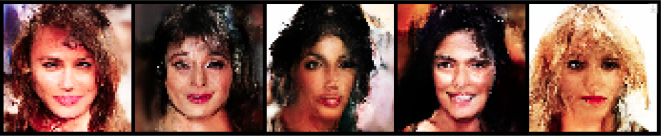
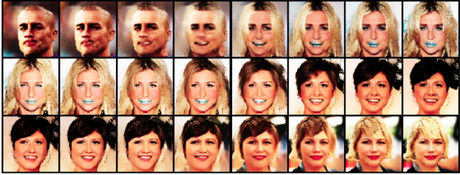
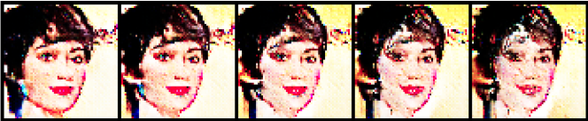

# Deep-Learning-and-Prcatice

This repo is Lab homework for 2021 Deep Learning and Practice class

teacher : 陳永昇、吳毅成、彭文孝

I use RTX 3060 Ti to inference and torch 1.9.0, cuda 11.1, if you want to use other version, please to edit install.sh.  

---

## Lab1

Lab1 implement backpropagation to handle linear and non-linear cases.

> Linear data accuracy : 97% \
> Non-linear data accuracy : 95.24%

## Lab2

Lab2 use RL N-tuple network to play 2048

> The 2048 win-rate in 1000 games : 98%

## Lab3

Lab3 implement EEGNet and DeepConvNet for EEG classification.

> EEGNet accuracy : 87.22%\
> DeepConvNet : 82.22%

## Lab4

Lab4 implement ResNet18 and ResNet50 for analysis diabetic retinopathy

> ResNet18 : 82.14%\
> ResNet50 : 82.21%

## Lab5

Lab5 implement conditional seq2seq vae transform English word tense.

> The BLEU score : 0.732\
> The Gaussian score : 0.74

## Lab6

Lab6 implement DQN, DDQN, DDPG to play LunarLander-v2 and LunarLanderContinuous-v2 Game.

> DQN : 255.24\
> DDQN : 281.33\
> DDPG : 288.35

## Lab7 

Lab7 implement CGAN and CNF for two tasks. For the first task, we need use CGAN and CNF with its condition to generate synthetic image. The second task, we need generate human face and three applications, including face generation, linear interpolation and attribute manipulation.

For the first task

> CGAN with test.json : 0.7\
> CGAN with new_test.json : 0.71\
> CNF with test.json : 0.45\
> CNF with new_test.json : 0.47

For the second tesk

> Conditional face generation

> Linear interpolation

> Attribute manipulation

This application use smile and chubby for example

